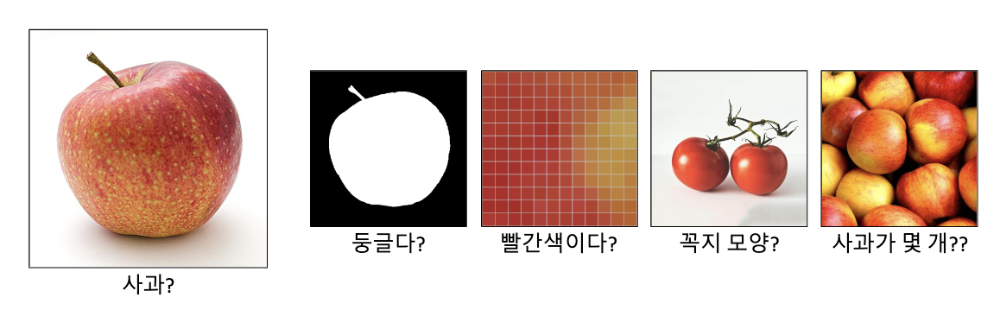
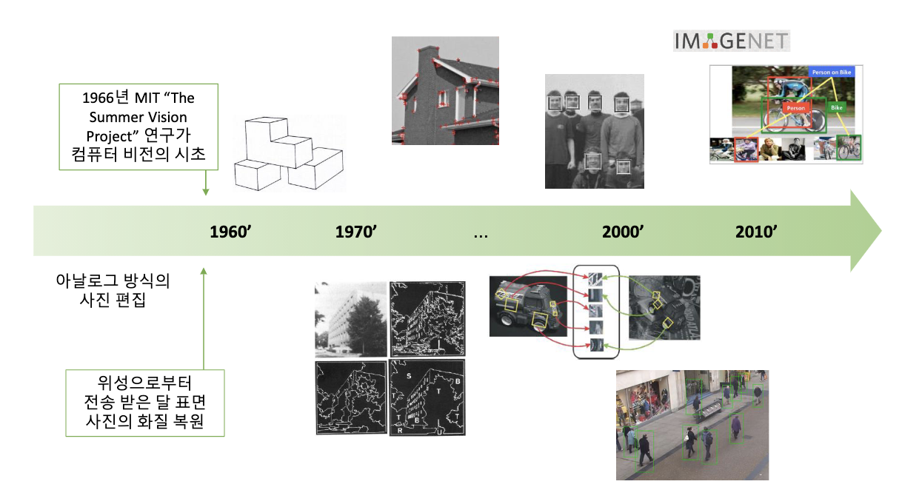
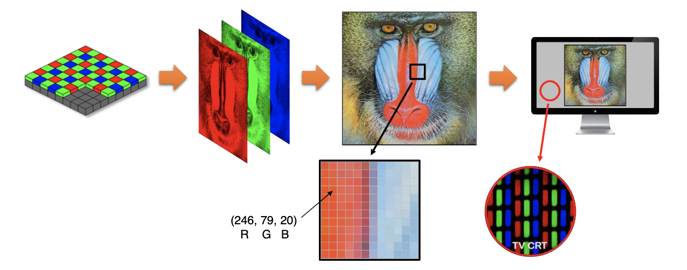
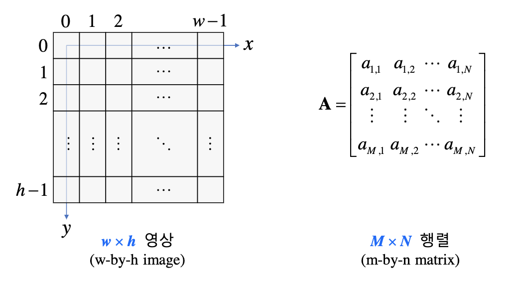

## Overview

- 강의 개요

|<컴퓨터 비전 기초>|<컴퓨터 비전 심화>|<머신 러닝과 딥러닝>|
|:--|:--|:--|
|OpenCV-Python 시작하기|영상의 특징 추출|머신 러닝|
|OpenCV-Python 기초 사용법|이진 영상 처리|딥러닝의 이해와 영상 인식|
|기본적인 영상 처리 기법|영상 분할 및 검출|딥러닝과 객체 검출|
|필터링과 모폴로지|키포인트 매칭||
|기하학적 변환|객체 추적과 모션 벡터||

- 참고 자료
    - "OpenCV 4로 배우는 컴퓨터 비전과 머신 러닝" (길벗, 2019)
        - Python 예제 코드 : [https://github.com/sunkyoo/opencv4cvml/tree/master/python](https://github.com/sunkyoo/opencv4cvml/tree/master/python)
    - OpenCV Tutorials
        - [https://docs.opencv.org/master/](https://docs.opencv.org/master/)

- 목차
    - [OpenCV-Python 시작하기](01_beginning_opencv-python.ipynb)
    - [OpenCV-Python 기초](02_fundamentals_opencv-python.ipynb)
    - [기본적인 영상처리 기법](03_fundamental_techniques.ipynb)
    - [필터링](04_image_filtering.ipynb)
    - [기하학적 변환](05_geometric_transformation.ipynb)
    - [특징 추출](06_features_extraction.ipynb)

- 컴퓨터 비전(Computer vision)
    - 컴퓨터를 이용하여 정지 영상 또는 동영상으로부터 의미 있는 정보를 추출하는 방법을 연구하는 학문이다. 
(i.e.) 즉, 사람이 눈으로 사물을 보고 인지하는 작업을 컴퓨터가 수행하게끔 만드는 학문

- 컴퓨터 비전과 영상 처리(image processing)

|컴퓨터 비전 ∋ 영상처리|vs|영상 처리 ∋ 컴퓨터 비전|
|:--:|:--:|:--:|
|컴퓨터 비전에서의 영상 처리는 영상을 입력으로 받아 화질을 개선하는 등의 처리를 하여 다시 영상을 출력으로 내보내는 작업||학문적 의미에서의 영상 처리는 영상을 다루는 모든 학문과 응용을 통틀어 지칭|
|컴퓨터 비전에서의 영상 처리는 컴퓨터 비전을 위한 전처리 작업||학문적 의미에서의 컴퓨터 비전은 영상 인식과 같은 고수준의 영상 처리를 지칭|
|`여기서 배우게 될 영상 처리의` `의미는 컴퓨터 비전에서의` `영상 처리를 말한다`|컴퓨터 비전 ≈ 영상 처리||

- 컴퓨터 비전 역사

- 컴퓨터 비전 관련 분야
    - [수학(Mathemetics)](https://ko.wikipedia.org/wiki/%EC%88%98%ED%95%99)
        - [선형대수(Linear Algebra)](https://ko.wikipedia.org/wiki/%EC%84%A0%ED%98%95%EB%8C%80%EC%88%98%ED%95%99)
        - [확률](https://ko.wikipedia.org/wiki/%ED%99%95%EB%A5%A0) / [통계(Statistics)](https://ko.wikipedia.org/wiki/%ED%86%B5%EA%B3%84%ED%95%99)
        - [해석학(Analysis)](https://ko.wikipedia.org/wiki/%ED%95%B4%EC%84%9D%ED%95%99_(%EC%88%98%ED%95%99))
        - [기하학(Geometry)](https://ko.wikipedia.org/wiki/%EA%B8%B0%ED%95%98%ED%95%99)
    - [컴퓨터 그래픽스(Computer Graphics)](https://ko.wikipedia.org/wiki/%EC%BB%B4%ED%93%A8%ED%84%B0_%EA%B7%B8%EB%9E%98%ED%94%BD%EC%8A%A4)
    - [인지 과학(Cognitive Science)](https://ko.wikipedia.org/wiki/%EC%9D%B8%EC%A7%80_%EA%B3%BC%ED%95%99)
    - [컴퓨터 과학(Computer Science)](https://ko.wikipedia.org/wiki/%EC%BB%B4%ED%93%A8%ED%84%B0_%EA%B3%BC%ED%95%99)
        - [수치 해석(Numerical Analysis)](https://ko.wikipedia.org/wiki/%EC%88%98%EC%B9%98%ED%95%B4%EC%84%9D%ED%95%99)
        - [알고리즘(Algorithm)](https://ko.wikipedia.org/wiki/%EC%95%8C%EA%B3%A0%EB%A6%AC%EC%A6%98)
        - [최적화(Optimization)](https://ko.wikipedia.org/wiki/%EC%88%98%ED%95%99%EC%A0%81_%EC%B5%9C%EC%A0%81%ED%99%94)
    - [머신러닝(Machine Learning)](https://ko.wikipedia.org/wiki/%EA%B8%B0%EA%B3%84_%ED%95%99%EC%8A%B5)
        - [딥러닝(Deep Learning)](https://ko.wikipedia.org/wiki/%EB%94%A5_%EB%9F%AC%EB%8B%9D)
        - [패턴 인식(Pattern recognition)](https://ko.wikipedia.org/wiki/%ED%8C%A8%ED%84%B4_%EC%9D%B8%EC%8B%9D)
    - [로봇공학(Robotics)](https://ko.wikipedia.org/wiki/%EB%A1%9C%EB%B4%87%EA%B3%B5%ED%95%99)
    - [광학(Optics)](https://ko.wikipedia.org/wiki/%EA%B4%91%ED%95%99)
    - [신호처리(Signal processing)](https://ko.wikipedia.org/wiki/%EC%8B%A0%ED%98%B8_%EC%B2%98%EB%A6%AC)
        - [주파수 분석(Frequency Analysis)](https://ko.wikipedia.org/wiki/%EC%A3%BC%ED%8C%8C%EC%88%98_%EC%98%81%EC%97%AD)
        - [디지털 신호처리(Digital signal processing)](https://ko.wikipedia.org/wiki/%EB%94%94%EC%A7%80%ED%84%B8_%EC%8B%A0%ED%98%B8_%EC%B2%98%EB%A6%AC)
        - [아날로그 신호처리(Analog signal processing)](https://ko.wikipedia.org/wiki/%EC%95%84%EB%82%A0%EB%A1%9C%EA%B7%B8_%ED%9A%8C%EB%A1%9C)

- 컴퓨터 비전 연구 분야
    - 영상의 화질 개선(Improving image quality)
        - 관련 기사(2021년도)
            - [정소영, ‘화질구지’를 해결하는 인공지능, 한국일보, 2021.06.05](https://www.hankookilbo.com/News/Read/A2021060309410000790)
        - 관련 논문
            - [이철, 2019, 극한 환경에서의 영상 시인성 개선을 위한 실시간 영상처리 기술 연구](https://scienceon.kisti.re.kr/srch/selectPORSrchReport.do?cn=TRKO202000000334)
            - [이헌상, 손광훈, 민동보, 2020, 자연스러운 저조도 영상 개선을 위한 비지도 학습](https://koreascience.or.kr/article/JAKO202010163508784.page)
        - 관련 학술지
            - [김원준, 인공지능 기반 영상 화질 개선 최신 기술 동향, 한국방송·미디어공학회, 2020년 1월 30일, 제25권 1호](http://www.kibme.org/periodicals/academyJournal?jo_idx=78)
    - 객체 검출과 영상 분할(Object Detecting & Image Segmentation)
    - 인식(Recognition)
- 컴퓨터 비전 응용 분야
    - 머신 비전(Machine vision)
        - 공장 자동화 : 제품의 불량 검사, 위치 확인, 측정 등
        - 높은 정확도와 빠른 처리 시간을 요구한다.
        - 조명, 렌즈, 필터, 실시간 처리(real-time processing)
    - 인공지능 서비스
        - 입력 영상을 객체와 배경으로 분할 -> 객체와 배경 인식 -> 상황 인식 -> 로봇과 자동차의 행동을 지시
        - 컴퓨터 비전(Computer Vision) + 센서 퓨전(Sensor Fusion) + 딥러닝(Deep Learning)
- 논문 및 학술지 사이트
    - [KoreaScience](https://www.koreascience.or.kr/main.page)
    - [ScienceON](https://scienceon.kisti.re.kr/main/mainForm.do)
    - [한국방송미디어공학회](http://www.kibme.org/)
    - [RISS](https://www.riss.kr/index.do)
    - [KCI](https://www.kci.go.kr/kciportal/main.kci)
    - [KISS](https://kiss.kstudy.com/)
    - [Google 학술검색](https://scholar.google.co.kr/)
    - [DBpia](https://www.dbpia.co.kr/)

- 영상(Image)이란
    - 픽셀(pixel)이 바둑판 모양의 격자에 나열되어 있는 형태(2차원 행렬)
    - 픽셀(pixel) : 영상의 기본 단위, pictures element, 화소(畵素 : 그림 화 / 본디 소)

- 영상의 표현 방법
    - 그레이스케일(grayscale) 영상
        - 흑백 사진처럼 색사 정보가 없이 오직 밝기 정보만으로 구성된 영상을 의미한다.
    - 그레이스케일 영상의 픽셀 값 표현
        - 밝기 성분을 `0~255` 범위의 정수로 표현한다.
        - 프로그래밍 언어에서 표현하는 방법 : `1Byte` 사용
            - C/C++ -> `unsigned char``
            - Python -> `numpy.uint8`
    - 트루컬러(truecolor) 영상
        - 컬러 사진처럼 색상 정보를 가지고 있어서 다양한 색상을 표현할 수 있는 영상을 의미한다.
        - Red, Green, Blue 색 성분을 256단계로 표현한다. 
-> 2563 = 16,777,216 개의 색상 표현이 가능하다.
    - 트루컬러 영상의 픽셀 값 표현
        - R, G, B 색 성분의 크기를 각각 `0~255` 범위의 정수로 표현한다.
            - 0 : 해당 색 성분이 전혀 없는 상태
            - 255 : 해당 색 성분이 가득 있는 상태
        - 프로그래밍 언어에서 표현하는 방법 : `3Byte` 사용
            - C/C++ -> `구조체, 클래스`
            - Python -> `튜플, numpy.ndarray`

- 영상에서 주로 사용되는 좌표계

- 영상 데이터 크기 분석
    - 그레이스케일 영상 : `(가로 크기) x (세로 크기)` Bytes
        - e.g.) 가로 512, 세로 512 크기의 그레이스케일 영상 -> 512 x 512 = 262144 Bytes
    - 트루컬러 영상 : `(가로 크기) x (세로 크기) x 3` Bytes
        - e.g.) 가로 1920, 세로 1080 크기의 트루컬러 영상 -> 1920 x 1080 x 3 = 6220800 Bytes ≈ 6.2 MBytes

- 영상 파일 형식 특징
    - BMP
        - 픽셀 데이터를 압축하지 않고 그대로 저장한다. 
-> 파일 용량이 큰 편
        - 파일 구조가 단순해서 별도의 라이브러리 도움 없이 파일 입출력 프로그래밍이 가능하다.
    - JPG
        - 주로 사진과 같은 컬러 영상을 저장한다.
        - 손실 압축(lossy compression)
        - 압축률이 좋아서 파일 용량이 크게 감소한다. 
-> 디지털 카메라 사진 포맷으로 주로 사용한다.
    - GIF
        - 256 색상 이하의 영상을 저장한다. 
-> 일반 사진을 저장 시 화질 열화가 심하다는 단점이 있다.
        - 무손실 압축(lossless cimpression)
        - 움직이는 GIF를 지원한다.
    - PNG
        - Portable Network Graphics의 약자이다.
        - 무손실 압축(컬러 영상도 무손실 압축)
        - 알파 채널(투명도)을 지원한다.